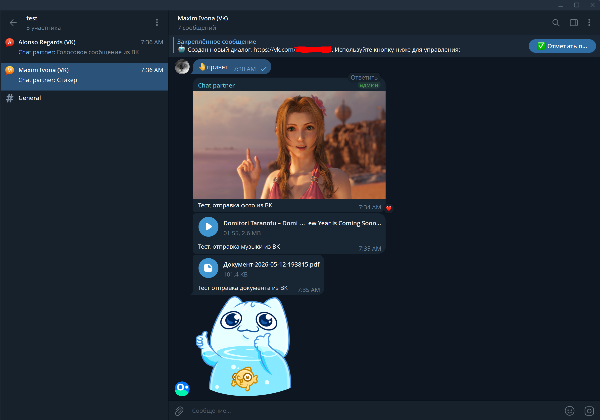
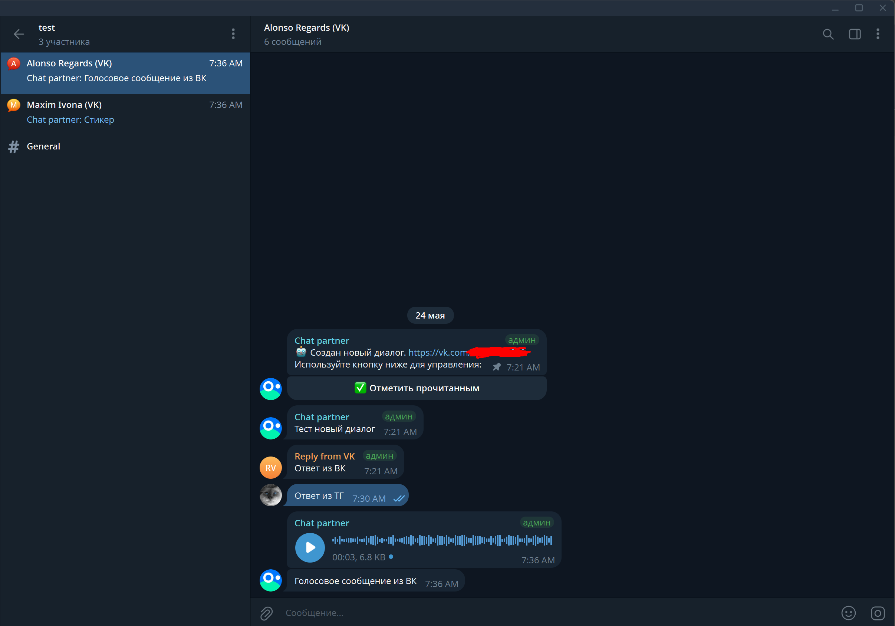

# vkadmin-msg
Бот для пересылки сообщений из группы ВКонтакте в Telegram с возможностью отвечать прямо из Telegram.

<p align="center">
  
  
</p>

## Возможности

📨 Из группы ВКонтакте в Telegram
Бот пересылает входящие сообщения, поддерживаются:

* Текстовые сообщения
* Пересылаемые и отвечаемые сообщения
* Фото
* Видео
* Документы
* Аудио
* Голосовые сообщения
* Стикеры

📤 Из Telegram в ВКонтакте
Ответы автоматически пересылаются обратно пользователю ВКонтакте, поддерживаются:

* Текстовые сообщения
* Фото
* Видео
* Документы
* Стикеры

🤖 vkBot — бот для группы ВКонтакте с кнопками и заготовленным текстом
* Настройка бота -> https://github.com/Maox222/vkadmin-messages/blob/main/VkBotConfig/VkBotConfig.md

## Установка приложения:
1. Установить .NET 8.0 - https://dotnet.microsoft.com/ru-ru/download/dotnet/8.0
2. Скомпилировать для своей платформы с помощью команды dotnet publish: Пример для linux
```bash
dotnet publish -c Release -r linux-x64 --self-contained false -o ./publish
```
3. Перейти к настройке.
4. После настройки можно установить как службу (в Windows) или сервиса (в Linux)

## Настройка приложения:
1. Для работы приложения нужно:
* Токен для основного бота (пересылает сообщения собеседника из группы ВК) -> [@BotFather](https://t.me/botfather)
* Id группы телеграм (с включенными темами) куда бот будет пересылать сообщения (отрицательное число), можно посмотреть в веб версии телеграм
* Опционально, токен для второго бота (пересылает сообщения админа если ответ был из интерфейса ВК)
* Kate Mobile токен -> https://vkhost.github.io/
* Id группы ВК (положительное число) откуда будут пересылаться сообщения
* Токен группы ВК -> Откройте страницу группы - Управление - Работа с API - Ключи доступа.
 Нажмите Создать ключ, выберите разрешение "Сообщения сообщества".
 Перейдите в Long Poll API → включите и добавьте событие "Входящие сообщения", "Исходящие сообщения", "Редактирование сообщения", "Действие с сообщением", "Разрешение на получение", "Запрет на получение".
* Опционально, настроить ВК бота (с кнопками и заготовленным текстом), смотри [VkBotConfig.md](https://github.com/Maox222/vkadmin-messages/blob/main/VkBotConfig/VkBotConfig.md)
2. Пригласить бота (ботов) в телеграм группу и выдать им права администратора
3. После сборки приложения надо перейти в корневую папку и отредактировать (создать) файл appsettings.json
```bash
{
    "BotConfig": {
        "TelegramBot": {
            "TgToken": "",              // Токен для основного бота (пересылает сообщения собеседника из группы ВК) -> @BotFather
            "AllowedGroupId": 0,        // Id группы телеграм куда бот будет пересылать сообщения (отрицательное число), можно посмотреть в веб версии телеграм
            "AllowReply": false,        // Опционально, если true то нужен токен от второго бота
            "SecondTgToken": ""         // Токен для второго бота (пересылает сообщения админа если ответ был из интерфейса ВК)
        },
        "Vk": {
            "KateMobileToken": "",      // Kate Mobile токен -> vkhost.github.io/
            "VkGroupId": 0,             // Id группы ВК (положительное число) откуда будут пересылаться сообщения
            "VkGroupToken": "",         // Токен группы -> Управление - Работа с API - Ключи доступа
            "AllowVkBot": false,        // Опционально, если true можно настроить ВК бота (с кнопками и заготовленным текстом), смотри VkBotConfig.md
            "VkBotConfig": {
                "VkResponsesPath": "vk_responses.json",     // Заготовленные ответы для бота ВК
                "VkKeyboardsPath": "vk_keyboards.json"      // Кнопки для бота ВК
            }
        },
        "DataMapFilePath": "datamap.json"
    },
    "Serilog": {
        "MinimumLevel": {
            "Default": "Warning",
            "Override": {
                "vkadmin_msg": "Information",
                "System.Net.Http.HttpClient": "Warning",
                "Microsoft.Extensions.Http": "Warning",
                "Microsoft.Extensions.Http.Logging": "Warning"
            }
        }
    }
}
```
3. Сохраняем, бот готов к работе!

## Деплой на сервер
1. Загрузка на сервер
```bash
scp -P порт_сервера -r ./publish/ имя@айпи:/ваш_путь/папка_для_бота/
```
Если хотите собрать проект самостоятельно (например после изменений в коде):
```bash
dotnet publish -c Release -r linux-x64 --self-contained false -o ./publish
scp -P порт_сервера -r ./publish/ имя@айпи:/ваш_путь/папка_для_бота/
```
2. Настройка службы systemd
Подключитесь к серверу по SSH и создайте файл службы:
```bash
sudo nano /etc/systemd/system/vkadmin.service
```
Вставьте содержимое из файла vkadmin.service (example) и заполните переменные:
```ini
[Unit]
Description=vkadmin-bot
After=network-online.target
Wants=network-online.target

[Service]
WorkingDirectory=/ваш_путь/папка_для_бота/publish/
ExecStart=/usr/bin/dotnet /ваш_путь/папка_для_бота/publish/vkadmin-msg.dll
Restart=always
RestartSec=10
KillSignal=SIGINT
User=ваше_имя

[Install]
WantedBy=multi-user.target
```
CTRL+O - сохранить, Enter - подтвердить, CTRL+X - выйти

3. Запуск службы
```bash
# Перезагрузить конфигурацию systemd
sudo systemctl daemon-reload

# Включить автозапуск при старте сервера
sudo systemctl enable vkadmin.service

# Запустить бота
sudo systemctl start vkadmin.service
```
4. Проверка
```bash
# Статус службы
sudo systemctl status vkadmin.service

# Логи в реальном времени
sudo journalctl -u vkadmin.service -f
```
### Управление ботом
```bash
# Стартовать
sudo systemctl start vkadmin.service

# Остановить
sudo systemctl stop vkadmin.service

# Перезапустить
sudo systemctl restart vkadmin.service

# Посмотреть последние 50 строк логов
sudo journalctl -u vkadmin.service -n 50 --no-pager
```
### Обновление бота
```bash
# 1. Пересобрать на компьютере
dotnet publish -c Release -r linux-x64 --self-contained false -o ./publish

# 2. Загрузить на сервер
scp -P порт_сервера -r ./publish/ имя@айпи:/ваш_путь/папка_для_бота/

# 3. Перезапустить службу на сервере
sudo systemctl restart vkadmin.service
```
